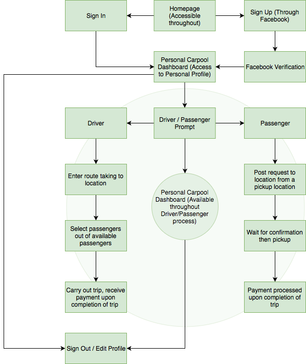
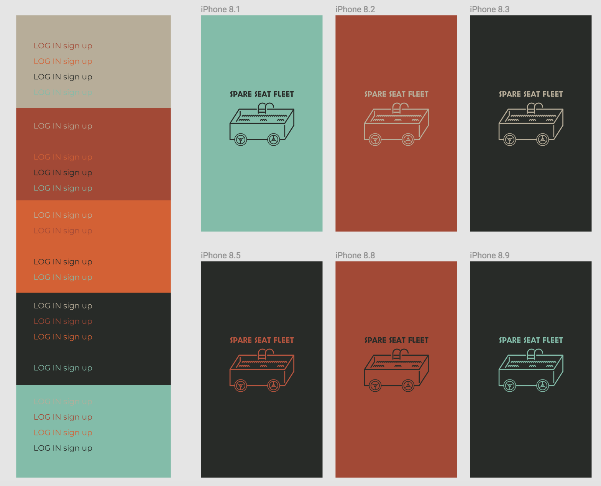
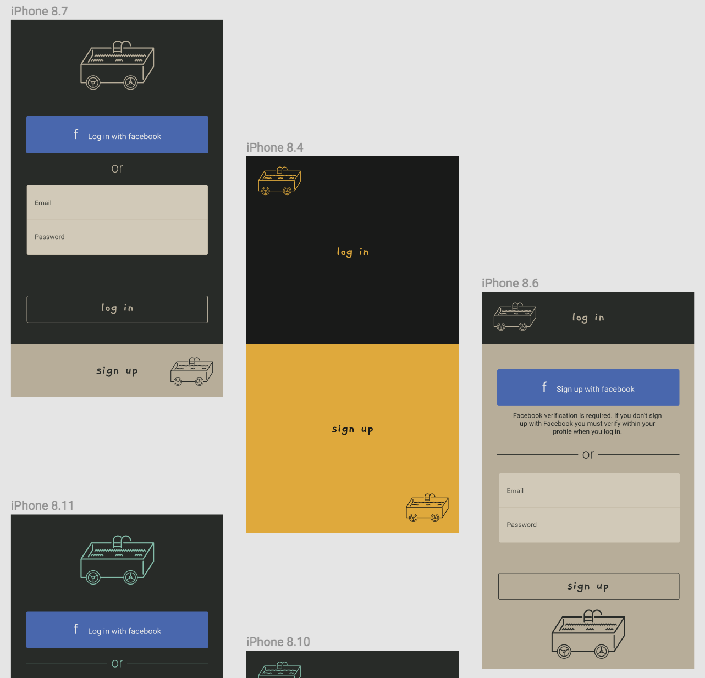
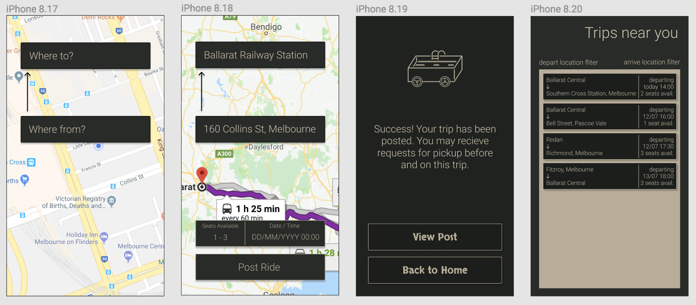
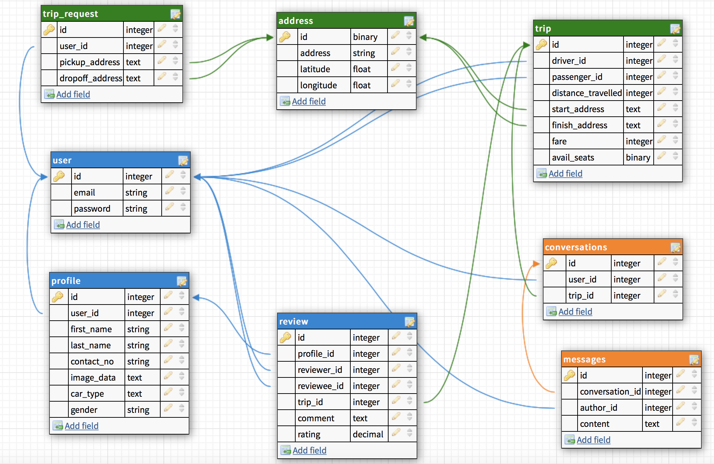
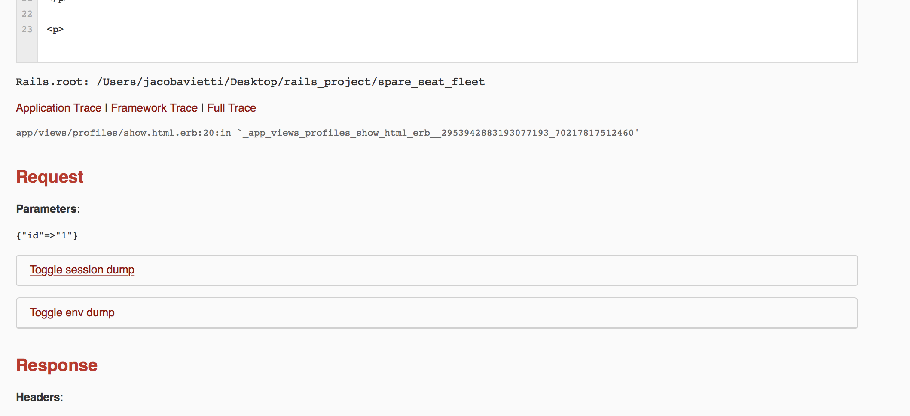

## Problem -- CARPOOLING

People who travel to and from the city who live in regional areas are forced to drive their car all the way to the city, or at least to the nearest train station every day. There some people who no matter what services are available will still drive their car to town out of feeling of freedom or needing a personal vehicle to get around. A combination of these two things allows for a good system of car-pooling to solve the problem. With many people driving in to the city each day with only one person in the vehicle, there are many cars that could be off the road and in the garage, while others share their seats to go to the same place.

My application will allow users to share their car seats for a for a fee, while not going (far) out of their way. A user can accept pickups from other users that are available nearby, while a user taking the role of a passenger may post themselves available for pickup. A single car trip is not limited to just a city. People who may be planning a road trip can also pick people up and drop them off on the way of their trip. The fee is dictated and processed by the application, so no user to user negotiations or friction should occur. Users may communicate with each other prior to pick-up through a phone-call or text if they see necessary.

Users may become friends with each other so they can see their routines each week. For example a driver may be able to see that they can fulfil the driving requirements for a user for 3 days in the week. They may communicate and lock in 3 days together, where the passenger will have to find another 2 drivers for the following two days. I am essentially creating a social platform as well as a travel platform, allowing people to connect on their commutes by having regular communication with similar people going to similar places.

The goal of the application is not to make an outlet for people to make a living on, but instead make travelling cheaper for both parties involved. At a large scale there could be a significant decrease in traffic on the roads, which has a multitude of benefits for everyone, not including users of the app.

## User Stories

There are two types of users. A driver and a passenger.

I created two personas of passengers and a single persona of a driver.

*Persona 1: Annie Bing* - I'm a 23 year old graduate from Ballarat and have been travelling to university for the past 4 years back and forward. I could never afford to live in Melbourne and would still rather not. I recently got a job working in the Royal Children's Hospital working 9-5 each day. I take the train each day but have to drive 20 minutes in my old Nissan Skyline which doesn't have great security. I would rather have someone drive me to the train station and leave my car at home.

Annie's user stories:
* As a carpool user I want to see a outline of the driver who may drive me to my location so that I can make a decision on who I want to travel with.
* As a carpool user I want the drivers to have some sort of verification so I know there are repercussions to their actions so that I can feel safer getting in a car with a stranger.
* As a 23 year old female using carpool I would hope I have the option to travel with other females only so I can feel safer travelling.
* As a carpool user I would like to be able to use the same driver if we get along, so that I can build a rapport with a new person and get cheaper rates over repeated trips if they feel the same way.
* As a carpool user I would like to be able to take the same driver back to my home, if their timetable lines up, so that I can keep building a friendship with that person.

*Persona 2: Dave King* - I'm a 40 year old man with two kids and a wife who also works. Her hours are a little more flexible as I drive to Melbourne each day from Ballarat and can't pick the kids up from school. I always have to leave early from Ballarat to be stuck in traffic for 30 minutes on the way to the city. Because I need my car for meetings I don't mind taking people to the city and making my petrol bill cheaper throughout the week.

Dave's user stories:
* As a driver of carpool I would like to be able to choose how out of my way I should drive to pick a passenger up so that I am not wasting too much time and I get to work on time.
* As a driver of carpool I would like to be able to blacklist passengers if we didn't get along at the end of the trip, so I don't have to deal with repeated clashing personalities.
* As a driver of carpool I would like the opportunity to share my timetable with passengers I get along with, so that I can organise long term who I am taking so I don't need to check the app every single day.
* As a driver of carpool I would rather not everyone see my route of travel from my house, rather have the start of travel the centre of my suburb or town, so that other users cannot see where I live.
* As a driver of carpool I would like to be able to communicate with passengers prior to picking them up so that I can get to know them better and get a feel for their personality before we spend an hour and a half in my car together.

*Persona 3: Jessie Westman* - I'm a 29 year old single male looking to hit as many festivals as I can. I usually go with all my friends but Iv'e just moved to Melbourne from Sydney. I knew it would be a struggle with no license but I'm looking for new avenues to see all my favourite shows. I work as a bricklayer during the week and am co-owners of the company so time off comes pretty easily.

Jessie's user stories:
* As a passenger of carpool I would like to be able to post my request for a ride earlier than the day, so that I have plenty of chance to have the request filled and make it to my venue on time.
* As a passenger of carpool I would like to be able to rate my drivers, so I can warn people of bad experiences and encourage good drivers to get more drives.
* As a passenger of carpool I would like to know if a replacement could be found if my driver cancelled on me so that I can still make my event.
* As a passenger I would like to know how much room a driver has for my gear I will bring to a festival, so I know there is sufficient room when he arrives at my pickup location.

## Workflow Diagram




## Wireframes


This was my design for the carpool logo. It has a very literal meaning.

\

A few different color schemes tested on my logo.

\

Login and Signup Page

\

Potential interface

## ERD



## Gems Used

Mailgun
Devise
Geocoder
Pundit
Rspec
Shrine
Stripe 

## Issues


Shrine took up a good amount of time for me resolving issues that seemed fairly abstract. I couldn't nail down the issue for about a day and a half. 

```
#in user model
include ImageUploader::Attachment.new(:image)
```
This was the missing code which I missed and made shrine not work at all.


## Database design issues

My database was designed poorly from the start, and required a lot of fixes late in the assignment. This caused my end result to not actually work or be deployed. 

Earlier on I needed to try and use my gems and explore how they worked. Geocoder can't accept two addresses in the same form and there's not a simple fix around it. I needed to use nested attributes in forms with the following method in the trip model.
```
accepts_nested_attributes_for :address
```
I figured this out very late and couldn't make it work.